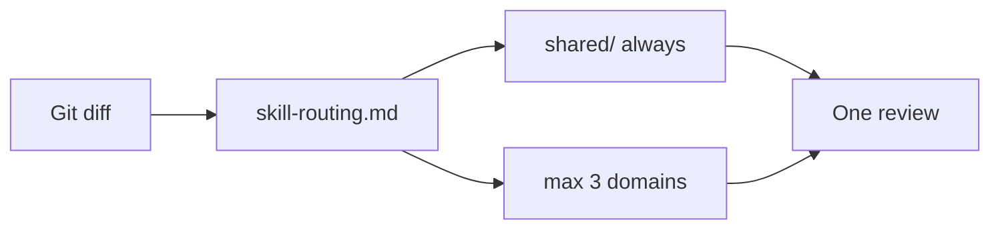

# CloudStaff Security AI Skills

Modular security **instructions** and **skills** for VS Code + GitHub Copilot. Markdown-only — no code execution.

1. **Clone or download** this repository
2. **Copy** `instructions/` and the full `skills/` tree into your app project
3. **Keep coding** — instructions apply automatically
4. **Run a review** when ready — Copilot Chat → `/quick-security-review`

---

## Setup

### Step 1: Get this repository

```bash
git clone <skills-repository-url>
```

Or download as ZIP from GitHub.

### Step 2: Copy files into your app repo

Create folders in your **application repository**:

```
your-app/
  .github/
    instructions/
    skills/
```

Copy from this repo:

| From this repo | To your app repo |
|--------------|------------------|
| `instructions/*.instructions.md` | `.github/instructions/` |
| `skills/` (entire tree) | `.github/skills/` |

The full `skills/` tree includes the entry skill, router, shared rules, and domain modules. Copy all folders — not just `quick-security-review/`.

Windows: use File Explorer. No bash or setup script required.

### Step 3: Reload VS Code

`Ctrl+Shift+P` → **Developer: Reload Window**

### Step 4: Verify

Run the checks in [Verify Instructions Are Working](docs/vscode-setup.md#verify-instructions-are-working).

---

## Daily Use

### Keep coding

Copilot loads **instructions** automatically:

| File | When it applies |
|------|-----------------|
| `.github/instructions/secure-coding-baseline.instructions.md` | Always — while you code |
| `.github/instructions/security-review-on-change.instructions.md` | When you edit auth, routes, controllers, etc. |

### Run a security review (before PR)

Open Copilot Chat (`Ctrl+Alt+I`):

```
/quick-security-review
```

The skill reads your git diff, routes to domain modules via `skill-routing.md`, and returns one consolidated security review in chat.

**Only `/quick-security-review` is a slash command.** Domain folders (`web/`, `backend/`, etc.) are support modules loaded by the router — not separate skills.

See [Which skill will run?](docs/vscode-setup.md#which-skill-will-run) and [Routing Explained](docs/routing-explained.md).

---

## How the Router Works



1. Read git diff only — no full repo scan
2. Match changed paths to domains (web, mobile, backend, infra)
3. Always load `shared/` rules
4. Load up to 3 domain module folders
5. Output one consolidated report with `**Modules loaded:**` header

Details: [architecture.md](docs/architecture.md) | [skill-overview.md](docs/skill-overview.md)

---

## Instructions vs Skills

| | Instructions | Skills |
|---|-------------|--------|
| **Folder** | `instructions/` | `skills/` |
| **Copy to** | `.github/instructions/` | `.github/skills/` |
| **How to run** | Automatic (`applyTo`) | `/quick-security-review` |
| **Purpose** | Prevent bad patterns while coding | Scan diff for security issues |

---

## Repository Structure

```
cloudstaff-security-ai-skills/
├── README.md
├── docs/
│   ├── architecture.md
│   ├── skill-overview.md
│   ├── routing-explained.md
│   ├── vscode-setup.md
│   └── contributing.md
├── instructions/
│   ├── secure-coding-baseline.instructions.md
│   └── security-review-on-change.instructions.md
├── skills/
│   ├── quick-security-review/
│   │   ├── SKILL.md
│   │   └── skill-routing.md
│   ├── shared/
│   │   ├── exploitability-gate.md
│   │   ├── low-noise-rules.md
│   │   ├── severity-calibration.md
│   │   └── security-checks.md
│   ├── web/
│   ├── mobile/
│   ├── backend/
│   └── infra/
└── templates/
    ├── instruction-snippets.md
    └── skill-snippets.md
```

---

## Troubleshooting

| Issue | Fix |
|-------|-----|
| Copilot ignores instructions | Confirm files in `.github/instructions/`; reload VS Code |
| Review does nothing | Copy full `skills/` tree; run `/quick-security-review` |
| Missing module error | Copy `shared/`, `web/`, `backend/`, etc. — not just entry skill |
| Wrong skill runs | Use `/quick-security-review` instead of vague prompts |
| No `Modules loaded:` in output | Re-copy `skill-routing.md` and domain folders |
| CIA check not triggering | Confirm CIA file in `.github/instructions/` |
| Changes not picked up | Reload window |

More detail: [VS Code Setup Guide](docs/vscode-setup.md)

---

## Contributing

See [contributing.md](docs/contributing.md).

Internal use — CloudStaff Security Engineering.
