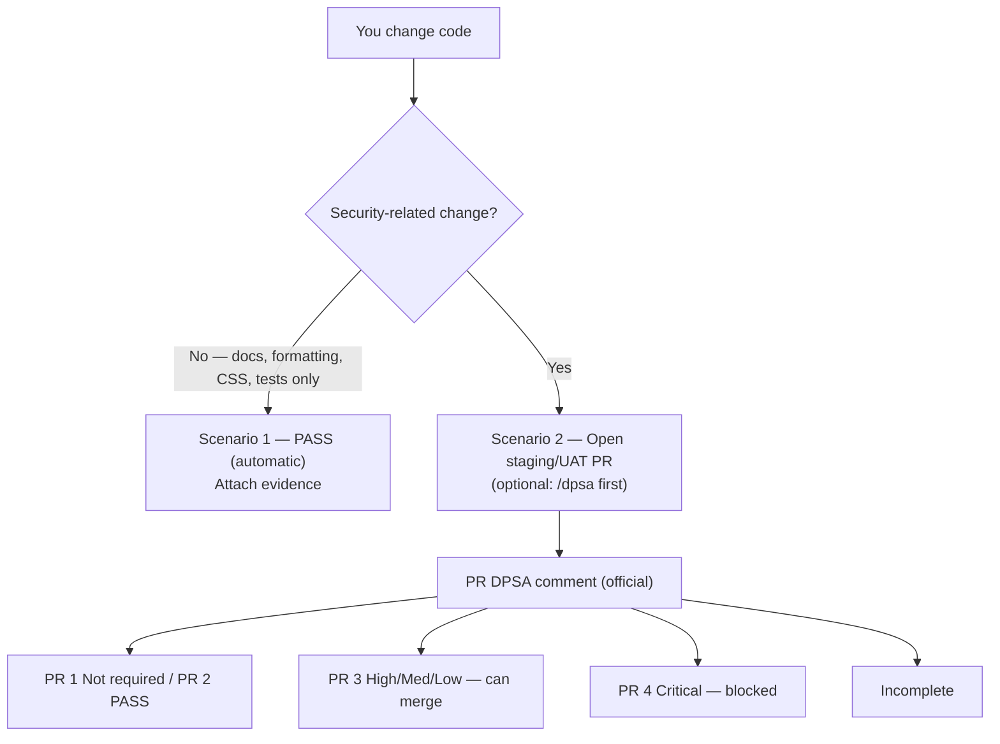
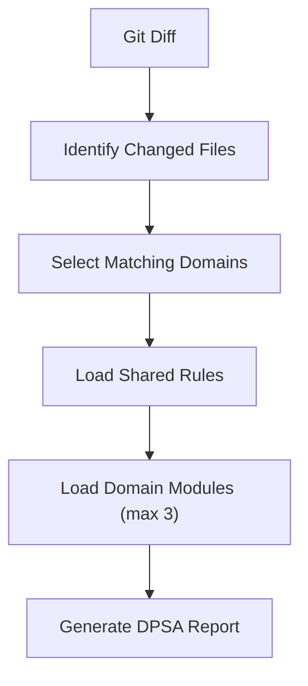

# Cloudstaff AI Security

Modular security **instructions**, **skills**, and **agents** for VS Code + GitHub Copilot. Skills are markdown; GitHub Actions posts the DPSA on staging/UAT PRs.

> **Upgrade reminder (v0.7.0):** `/quick-security-review` was renamed to `/dpsa`. Re-copy the full `skills/` tree (include `dpsa/`, delete `quick-security-review/`), both instructions, and **all four** `agents/*.agent.md`. Reload VS Code. Use `/dpsa` going forward.

---

## Quick Setup

This toolkit has **no** `.github/` of its own. You copy its folders **into the app repo’s** `.github/`.

VS Code `/dpsa` uses each person’s Copilot Chat login. The steps below are only for the **GitHub Action** on a PR.

### 1. Download this repo

Clone or download [cloudstaff-apps/ai-security](https://github.com/cloudstaff-apps/ai-security).

### 2. Copy into the app’s `.github/` folder

```text
ai-security/                 your-app/.github/
  instructions/       →        instructions/
  skills/             →        skills/
  agents/             →        agents/
  workflows/          →        workflows/
  dpsa-ci/            →        dpsa-ci/
```

### 3. Set the PR base branches

Edit `your-app/.github/workflows/dpsa-pr-comment.yml`. Under `on.pull_request.branches`, **keep the names this app merges into** (staging, UAT, `master`, `main`, or your app’s name such as `iacc-staging`) and **comment out or delete the rest**.

```yaml
    branches:
      - iacc-staging          # keep yours
      # - staging
      # - stage
      # - uat
      # - main
      # - master
      # - "*-staging"
```

The workflow runs only when a PR’s **base** matches those names. It does not run on every PR.

### 4. Set the Copilot token (env on the Copilot CLI step)

In the same file, the Copilot CLI step `env:` (around lines 75–79) already defaults to the built-in Actions token. Leave it or switch it:

| Where the app repo lives | What to put in `env:` | Extra setup |
|--------------------------|----------------------|-------------|
| **Organization** (for example `cloudstaff-apps/…`) | `COPILOT_GITHUB_TOKEN: ${{ github.token }}` | **None.** This is the default. Org Copilot policy must allow Copilot CLI billed to the organization (admin does this once). |
| **User-owned** (your personal public or private repo) | `COPILOT_GITHUB_TOKEN: ${{ secrets.COPILOT_GITHUB_TOKEN }}` | Create a fine-grained PAT and a repo Actions secret. See below. |

**Organization repo (default — no secret):**

```yaml
        env:
          COPILOT_GITHUB_TOKEN: ${{ github.token }}
          # COPILOT_GITHUB_TOKEN: ${{ secrets.COPILOT_GITHUB_TOKEN }}
```

The workflow already includes `permissions: copilot-requests: write`. Do not create a PAT or Actions secret.

**User-owned repo (public or private):**

1. Comment out the `github.token` line and uncomment the secret line:

```yaml
        env:
          # COPILOT_GITHUB_TOKEN: ${{ github.token }}
          COPILOT_GITHUB_TOKEN: ${{ secrets.COPILOT_GITHUB_TOKEN }}
```

2. Create a [fine-grained PAT](https://github.com/settings/personal-access-tokens/new):
   - **Resource owner:** your **personal** account (not an org)
   - **Repository access:** this repo (or all of yours)
   - **Account permissions:** **Copilot Requests**
   - Classic `ghp_` tokens do **not** work. The token starts with `github_pat_`
3. Repo → **Settings → Secrets and variables → Actions** → New repository secret named exactly `COPILOT_GITHUB_TOKEN` (letters, numbers, `_` only — no hyphens). Paste the PAT. Do not commit it.

GitHub App client secrets and private keys do **not** work as this value.

Details: [Using Copilot CLI in GitHub Actions](https://docs.github.com/en/copilot/how-tos/copilot-cli/use-copilot-cli-in-actions) · [PR comments](docs/dpsa-github-actions.md)

### 5. Commit the copied files

> [!IMPORTANT]
> **Commit** `instructions/`, `skills/`, `agents/`, `workflows/`, and `dpsa-ci/` under the **app** repo’s `.github/`.
>
> A local copy is not enough. GitHub Actions only runs files that are on GitHub.
>
> Do **not** commit a PAT or any secret.

Reload VS Code after the copy (`Developer: Reload Window`).

### 6. Open a PR into your chosen base branch

The Action comments the DPSA report. **Critical** fails the check and converts the PR to **draft** so Merge is disabled.

### 7. What locks merge

**Critical** fails the job, converts the PR to **draft**, and adds **`dpsa-blocked`**. High / Medium / Low stay on the comment. **Ready for review** does not unlock — only a fix + push, or **`dpsa-exception`** plus Finding Analyst as a PR comment.

Other org repos are unchanged until they copy this toolkit.

More: [VS Code Setup](docs/vscode-setup.md) · [PR comments](docs/dpsa-github-actions.md)

---

## I want to…

| I want to…                                  | Use                                                              |
| ------------------------------------------- | ---------------------------------------------------------------- |
| Write secure code                           | Copilot instructions (only when Copilot writes or edits)         |
| Review the current diff for security (optional) | `/dpsa` — AI DPSA report in VS Code (same as the PR comment) |
| Official DPSA on staging/UAT PR             | GitHub Action — Critical can block; High/Medium/Low comment only |
| Perform a formal pre-merge review (persona) | Security Review agent                                            |
| Validate one DPSA finding                   | DPSA Finding Analyst (suggestions only — never edits)            |
| Dependabot guidance / bump implications     | Dependabot Advisor (never upgrades)                              |
| Review an entire release / sprint           | `/full-assessment-security-review`                               |
| Analyze a Jira ticket                       | `/jira-security-advisory`                                        |
| Assess Dependabot alerts                    | `/dependabot-assess` (chat only — never upgrades)                |
| Plan security requirements                  | Security Advisor agent                                           |

Use **Security Advisor** during planning. Use **Security Review** / `/dpsa` after code has changed. Use **DPSA Finding Analyst** on one pasted finding. Use **Dependabot Advisor** to talk through an alert — never to bump.

---

### Instructions (when Copilot writes or edits)

1. **Secure coding baseline** — applies when Copilot generates or edits a file. Manual coding does not trigger it. For **non-security-only** Copilot edits (docs, formatting, CSS-only, static copy, tests-only, etc.), it **automatically** appends **Scenario 1: PASS** with **Related tickets** and a short **Change summary**.
2. **CIA self-check** — **CIA = Confidentiality, Integrity, Availability.** When Copilot edits security-sensitive paths (auth, APIs, services, payments, uploads, tenant, admin, config, LLM/agents, and related folders), it gives a brief security reminder. **Not** a formal `/dpsa` report. Paths outside that list still get the baseline, which can emit Scenario 2 and point to `/dpsa`.

### Skills (slash commands)

- `/dpsa` — **Digital Product Security Assessment.** In Copilot Chat, reviews the **current git diff** (changed lines only). Optional preview in VS Code — never blocks merge. Official record is the GitHub Action comment on a staging/UAT PR (PR Scenarios 1–4).
- `/full-assessment-security-review` — sprint/release scope (date, branch, PR)
- `/jira-security-advisory` — (Optional) Jira fetch via [Atlassian MCP](docs/jira-copilot-setup.md); optional comment after confirmation
- `/dependabot-assess` — Dependabot alert vs this app (usage, reachability, blast-radius **advice**). Never upgrades.

### Agents (Copilot Chat picker)

- **Security Review** — same workflow as `/dpsa` (formal, read-only)
- **Security Advisor** — threat modeling and security acceptance criteria during feature planning — before implementation
- **DPSA Finding Analyst** — paste one DPSA File+Line; confirm if it is real; **suggest** a minimal fix. Never edits.
- **Dependabot Advisor** — explain an alert, blast radius, and fix **options**. Never upgrades.

Domain folders (`web/`, `backend/`, …) are support modules loaded by skills — not separate slash commands.

---

## Development Workflow

**When Copilot writes or edits code** — instructions apply automatically. Manual coding does not trigger them.

**Optional before a PR:** `/dpsa` in VS Code (preview).

**Official record:** open a same-repo PR into **staging/UAT**. **PR 1 / 2** ready to merge. **PR 3** (High / Medium / Low) can merge. **PR 4** (Critical) converts the PR to **draft** until you fix those lines or add `dpsa-exception` (developer or Security) and comment the Finding Analyst result on the PR. VS Code `/dpsa` never blocks.

Or select the **Security Review** agent. If a PR already has the DPSA comment, put the **PR URL** on Jira / the Release Ticket — do not screenshot-attach as well. Screenshot only when there is no PR. Scenario outcomes: [Development Workflow](docs/development-workflow.md) · `[dpsa-next-steps.md](skills/shared/dpsa-next-steps.md)`.



**Tip:** Sample PR comments: [dpsa-pr-scenario-samples.md](docs/dpsa-pr-scenario-samples.md).

---

## How the Router Works



Limiting analysis to the **three most relevant domains** reduces noise, improves response quality, and keeps Copilot within its context window.

Details: [Routing Explained](docs/routing-explained.md) · [Architecture](docs/architecture.md)

---

## Docs

| Topic                             | Doc                                                     |
| --------------------------------- | ------------------------------------------------------- |
| Installation & verify             | [vscode-setup.md](docs/vscode-setup.md)                 |
| Development workflow & scenarios  | [development-workflow.md](docs/development-workflow.md) |
| Architecture                      | [architecture.md](docs/architecture.md)                 |
| Routing                           | [routing-explained.md](docs/routing-explained.md)       |
| OWASP severity                    | [owasp-severity.md](docs/owasp-severity.md)             |
| Skill catalog                     | [skill-overview.md](docs/skill-overview.md)             |
| Jira MCP                          | [jira-copilot-setup.md](docs/jira-copilot-setup.md)     |
| DPSA PR comments (GitHub Actions) | [dpsa-github-actions.md](docs/dpsa-github-actions.md)   |
| DPSA PR comment samples           | [dpsa-pr-scenario-samples.md](docs/dpsa-pr-scenario-samples.md) |

---

## Troubleshooting

| Issue                                 | Fix                                                    |
| ------------------------------------- | ------------------------------------------------------ |
| Copilot ignores instructions          | Files under `.github/instructions/`? Reload VS Code    |
| `/dpsa` does nothing                  | Copy full `skills/` tree (not only `dpsa/`)            |
| Agents missing from picker            | Copy `agents/*.agent.md` → `.github/agents/`; reload   |
| Still seeing `/quick-security-review` | Delete old folder; re-copy skills + agents from v0.7.0 |
| Actions: `No authentication information found` | Org repo: keep `${{ github.token }}` and `copilot-requests: write`. User-owned repo: PAT + secret `COPILOT_GITHUB_TOKEN`. Do not use a GitHub App client secret or private key. |

More: [VS Code Setup — Troubleshooting](docs/vscode-setup.md).

---

Internal use — Cloudstaff
