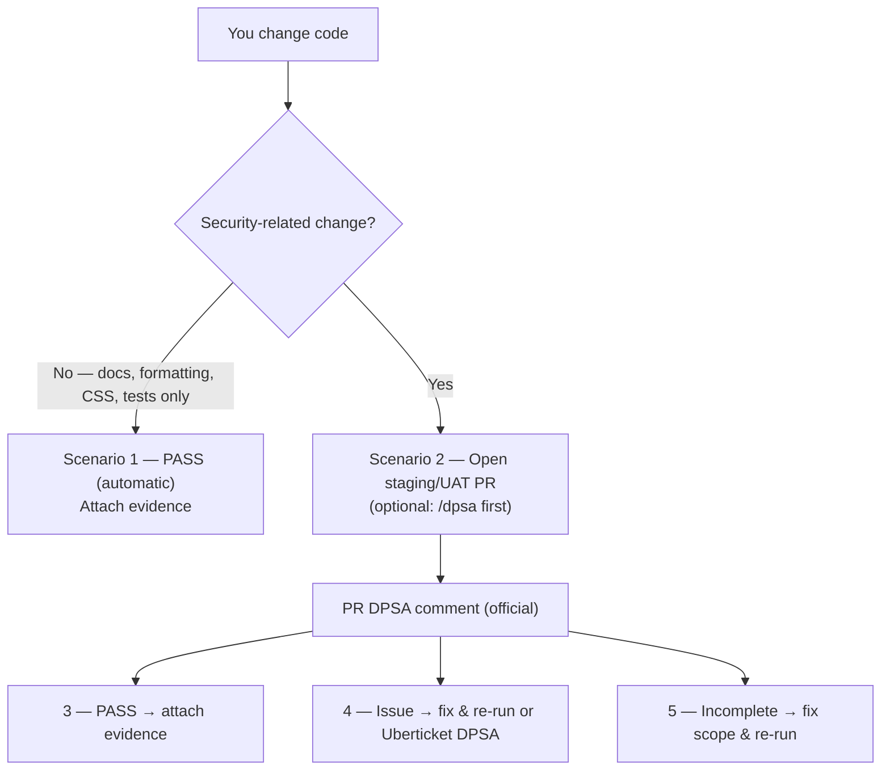
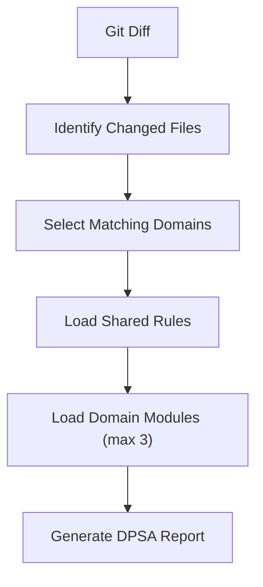

# Cloudstaff AI Security

Modular security **instructions**, **skills**, and **agents** for VS Code + GitHub Copilot. Skills are markdown; GitHub Actions posts the DPSA on staging/UAT PRs.

> **Upgrade reminder (v0.7.0):** `/quick-security-review` was renamed to `/dpsa`. Re-copy the full `skills/` tree (include `dpsa/`, delete `quick-security-review/`), both instructions, and **all four** `agents/*.agent.md`. Reload VS Code. Use `/dpsa` going forward.

---

## Quick Start

This toolkit has **no** `.github/` of its own. You copy its folders **into the app repo’s** `.github/`.

### 1. Download and copy

```text
ai-security/                 your-app/.github/
  instructions/       →        instructions/
  skills/             →        skills/
  agents/             →        agents/
  workflows/          →        workflows/
  dpsa-ci/            →        dpsa-ci/
```


### 2. Set your staging / UAT branch names

Edit `your-app/.github/workflows/dpsa-pr-comment.yml`. Under `on.pull_request.branches`, **keep the names this app merges into** (for example `iacc-staging`) and **comment out or delete the rest**.

```yaml
    branches:
      - iacc-staging          # keep yours
      # - staging
      # - stage
      # - uat
      # - "*-staging"
```

The workflow runs only when a PR’s **base** matches those names. It does not run on every PR.

### 3. Commit the copied files

> [!IMPORTANT]
> **Commit the copied files** in the **app** repo: `instructions/`, `skills/`, `agents/`, `workflows/`, and `dpsa-ci/` under `.github/`.
>
> A local copy is not enough. GitHub Actions only runs files that are on GitHub. Teammates only get `/dpsa` and the instructions after this commit.
>
> Do **not** commit the PAT or any secret.

Reload VS Code after the copy (`Developer: Reload Window`).

### 4. One Actions token (not one per developer)

VS Code `/dpsa` uses each person’s Copilot Chat login. Opening a PR does **not** need a developer PAT.

The secret is only for the **GitHub Action**. **One token for the whole team is enough.** Copilot Requests on a fine-grained PAT can cover **all repositories you grant, including private**.

Pick **one** option.

#### Option A — PAT from a user account, then an Actions secret

**Create the PAT** (one admin or bot user — not every developer):

1. Open [Create a fine-grained PAT](https://github.com/settings/personal-access-tokens/new)
2. **Resource owner:** that user’s **personal** account (not the org)
3. **Repository access:** All repositories (or only the app repos). Works for **private** repos.
4. **Account permissions:** add **Copilot Requests**
5. Classic `ghp_` tokens do **not** work. Generate and copy the token.

**Create the Actions secret** named exactly `COPILOT_GITHUB_TOKEN` (paste the PAT — do not commit it):


| Secret location                                               | When                                                |
| ------------------------------------------------------------- | --------------------------------------------------- |
| **Organization** → Settings → Secrets and variables → Actions | One secret for every granted app repo (recommended) |
| **Repository** → Settings → Secrets and variables → Actions   | This app only                                       |


#### Option B — Organization token (no PAT)

If the org Copilot policy **Allow use of Copilot CLI billed to the organization** is on, the workflow can use the built-in Actions token (`${{ github.token }}`) with permission `copilot-requests: write`. No PAT and no `COPILOT_GITHUB_TOKEN` secret. Usage bills the org.

Details: [Using Copilot CLI in GitHub Actions with GITHUB_TOKEN](https://docs.github.com/en/copilot/how-tos/copilot-cli/use-copilot-cli-in-actions) · this repo’s workflow notes in [PR comments](docs/dpsa-github-actions.md)

### 5. Open a PR into staging / UAT

The Action comments the DPSA report. **Critical** can fail the check.

More: [VS Code Setup](docs/vscode-setup.md) · [PR comments](docs/dpsa-github-actions.md)

---


## I want to…


| I want to…                                  | Use                                                              |
| ------------------------------------------- | ---------------------------------------------------------------- |
| Write secure code                           | Copilot instructions (only when Copilot writes or edits)         |
| Review the current diff for security (optional) | `/dpsa` — AI DPSA report in VS Code (same as the PR comment) |
| Official DPSA on staging/UAT PR             | GitHub Action — Critical can block; High/Medium/Low comment only |
| Perform a formal pre-merge review (persona) | Security Review agent                                            |
| Validate one DPSA finding                   | DPSA Finding Analyst (suggestions only — never edits)            |
| Dependabot guidance / bump implications     | Dependabot Advisor (never upgrades)                              |
| Review an entire release / sprint           | `/full-assessment-security-review`                               |
| Analyze a Jira ticket                       | `/jira-security-advisory`                                        |
| Assess Dependabot alerts                    | `/dependabot-assess` (chat only — never upgrades)                |
| Plan security requirements                  | Security Advisor agent                                           |


Use **Security Advisor** during planning. Use **Security Review** / `/dpsa` after code has changed. Use **DPSA Finding Analyst** on one pasted finding. Use **Dependabot Advisor** to talk through an alert — never to bump.

---


### Instructions (when Copilot writes or edits)

1. **Secure coding baseline** — applies when Copilot generates or edits a file. Manual coding does not trigger it. For **non-security-only** Copilot edits (docs, formatting, CSS-only, static copy, tests-only, etc.), it **automatically** appends **Scenario 1: PASS** with **Related tickets** and a short **Change summary**.
2. **CIA self-check** — **CIA = Confidentiality, Integrity, Availability.** When Copilot edits security-sensitive paths (auth, APIs, services, payments, uploads, tenant, admin, config, LLM/agents, and related folders), it gives a brief security reminder. **Not** a formal `/dpsa` report. Paths outside that list still get the baseline, which can emit Scenario 2 and point to `/dpsa`.


### Skills (slash commands)

- `/dpsa` — **Digital Product Security Assessment.** In Copilot Chat, reviews the **current git diff** (changed lines only) and replies with a report: **PASS**, **Security Issue Identified** (File + Line), or **REVIEW INCOMPLETE**, plus what to do next. Optional preview in VS Code — never blocks merge. Same report as the GitHub Action on a staging/UAT PR. Distinct from an Uberticket DPSA ticket (PM-1136).
- `/full-assessment-security-review` — sprint/release scope (date, branch, PR)
- `/jira-security-advisory` — (Optional) Jira fetch via [Atlassian MCP](docs/jira-copilot-setup.md); optional comment after confirmation
- `/dependabot-assess` — Dependabot alert vs this app (usage, reachability, blast-radius **advice**). Never upgrades.


### Agents (Copilot Chat picker)

- **Security Review** — same workflow as `/dpsa` (formal, read-only)
- **Security Advisor** — threat modeling and security acceptance criteria during feature planning — before implementation
- **DPSA Finding Analyst** — paste one DPSA File+Line; confirm if it is real; **suggest** a minimal fix. Never edits.
- **Dependabot Advisor** — explain an alert, blast radius, and fix **options**. Never upgrades.

Domain folders (`web/`, `backend/`, …) are support modules loaded by skills — not separate slash commands.

---


## Development Workflow

**When Copilot writes or edits code** — instructions apply automatically. Manual coding does not trigger them.

**Optional before a PR:** `/dpsa` in VS Code (preview).

**Official record:** open a same-repo PR into **staging/UAT**. The Action comments the DPSA report. **Critical** fails the check (blocks merge if that check is required) until you **fix those lines** or add `dpsa-exception` after filing Uberticket DPSA for **that finding**. High/Medium/Low do not fail. VS Code `/dpsa` never blocks.

Or select the **Security Review** agent. If a PR already has the DPSA comment, put the **PR URL** on Jira / the Release Ticket — do not screenshot-attach as well. Screenshot only when there is no PR. Scenario outcomes: [Development Workflow](docs/development-workflow.md) · `[dpsa-next-steps.md](skills/shared/dpsa-next-steps.md)`.




**Tip:** `/dpsa` is the AI skill. A **DPSA ticket in Uberticket** (PM-1136) is the manual Security Team assessment.

---


## How the Router Works




Limiting analysis to the **three most relevant domains** reduces noise, improves response quality, and keeps Copilot within its context window.

Details: [Routing Explained](docs/routing-explained.md) · [Architecture](docs/architecture.md)

---


## Docs


| Topic                             | Doc                                                     |
| --------------------------------- | ------------------------------------------------------- |
| Installation & verify             | [vscode-setup.md](docs/vscode-setup.md)                 |
| Development workflow & scenarios  | [development-workflow.md](docs/development-workflow.md) |
| Architecture                      | [architecture.md](docs/architecture.md)                 |
| Routing                           | [routing-explained.md](docs/routing-explained.md)       |
| OWASP severity                    | [owasp-severity.md](docs/owasp-severity.md)             |
| Skill catalog                     | [skill-overview.md](docs/skill-overview.md)             |
| Jira MCP                          | [jira-copilot-setup.md](docs/jira-copilot-setup.md)     |
| DPSA PR comments (GitHub Actions) | [dpsa-github-actions.md](docs/dpsa-github-actions.md)   |


---


## Troubleshooting


| Issue                                 | Fix                                                    |
| ------------------------------------- | ------------------------------------------------------ |
| Copilot ignores instructions          | Files under `.github/instructions/`? Reload VS Code    |
| `/dpsa` does nothing                  | Copy full `skills/` tree (not only `dpsa/`)            |
| Agents missing from picker            | Copy `agents/*.agent.md` → `.github/agents/`; reload   |
| Still seeing `/quick-security-review` | Delete old folder; re-copy skills + agents from v0.7.0 |


More: [VS Code Setup — Troubleshooting](docs/vscode-setup.md).

---

Internal use — Cloudstaff