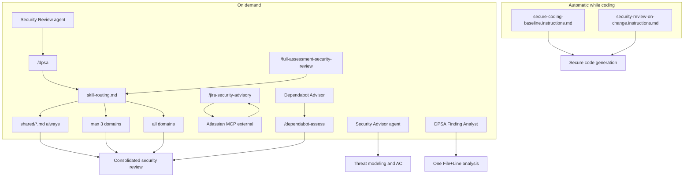

# Architecture

Cloudstaff AI Security is a **markdown** toolkit for VS Code + GitHub Copilot, plus a GitHub Action that posts the DPSA on staging/UAT PRs. Skills do not execute application code.

---

## Layers



| Layer | Location | When active | Purpose |
|-------|----------|-------------|---------|
| **Instructions** | `.github/instructions/*.instructions.md` | Automatic (`applyTo`) | Prevent insecure patterns while coding |
| **Agents** | `.github/agents/*.agent.md` | User selects in chat | Specialist persona, tool limits, output format |
| **Entry skill (dpsa)** | `.github/skills/dpsa/SKILL.md` | `/dpsa` | Optional VS Code preview; same report as the PR Action |
| **Entry skill (full)** | `.github/skills/full-assessment-security-review/SKILL.md` | `/full-assessment-security-review` | Wide-scope assessment (all domains) |
| **Entry skill (jira)** | `.github/skills/jira-security-advisory/SKILL.md` | `/jira-security-advisory` | Jira ticket advisory via MCP |
| **Entry skill (dependabot)** | `.github/skills/dependabot-assess/SKILL.md` | `/dependabot-assess` | Dependabot alert vs app — assess only, never upgrades |
| **Jira workflow** | `.github/skills/jira-security-advisory/jira-workflow.md` | Loaded by Jira skill | MCP fetch/post steps |
| **Dependabot scope** | `.github/skills/dependabot-assess/alert-scope.md` | Loaded by `/dependabot-assess` | Alert # / range / default 3 + GET allowlist |
| **Router (dpsa)** | `.github/skills/dpsa/skill-routing.md` | Loaded by `/dpsa` | Max 3 domain selection |
| **Router (full)** | `.github/skills/full-assessment-security-review/skill-routing.md` | Loaded by full skill | All matching domains |
| **Scope (full)** | `.github/skills/full-assessment-security-review/scope-resolution.md` | Loaded by full skill | git + gh PR/date/branch resolution |
| **Shared modules** | `.github/skills/shared/*.md` | Always loaded | Universal gates, checks, OWASP severity, DPSA next steps |
| **App context** | `.github/security-context.md` | Loaded if present | Per-app OWASP scoring (app size, repo access) |
| **Domain modules** | `.github/skills/{web,mobile,backend,infra}/*.md` | Up to 3 per review | Domain-specific checks |

---

## Slash Commands vs Modules

**Only folders containing `SKILL.md` become Copilot slash commands.**

| Path | Slash command? |
|------|----------------|
| `skills/dpsa/SKILL.md` | Yes → `/dpsa` |
| `skills/full-assessment-security-review/SKILL.md` | Yes → `/full-assessment-security-review` |
| `skills/jira-security-advisory/SKILL.md` | Yes → `/jira-security-advisory` |
| `skills/dependabot-assess/SKILL.md` | Yes → `/dependabot-assess` |
| `skills/shared/` | No — support modules |
| `skills/web/`, `mobile/`, `backend/`, `infra/` | No — domain modules |

Domain and shared folders are loaded **by reference** when the entry skill runs. They are not independently invokable.

---

## Deterministic Router

The system behaves as a **security router**, not a free-form agent:

1. Read git diff only — no full repo scan
2. Apply path patterns from `skill-routing.md` — no AI discretion on module selection
3. Always load the 7 named shared modules required by `/dpsa` (not a glob; excludes `jira-integration-safety.md`)
4. Select max 3 domain folders by match count (reduces noise and fits Copilot context)
5. Load all module files within each selected domain
6. Apply checks in order: domain modules → shared triage (`security-checks.md`) → exploitability gate → OWASP severity
7. Output one consolidated report

See [routing-explained.md](routing-explained.md) for the full algorithm.

---

## Copy Model

Developers copy from the skills repo into their **application repository**:

| Skills repo | App repo |
|-------------|----------|
| `instructions/*` | `.github/instructions/*` |
| `skills/**` (entire tree) | `.github/skills/**` |
| `agents/*.agent.md` | `.github/agents/*.agent.md` |
| `workflows/` | `.github/workflows/` |
| `dpsa-ci/` | `.github/dpsa-ci/` |
| `templates/security-context.md` | `.github/security-context.md` (optional, per app) |

`docs/` and other `templates/` stay in the skills repo — author reference only.

After copying, reload VS Code: `Ctrl+Shift+P` → Developer: Reload Window.

---

## Lifecycle

| Layer | When | What it does |
|-------|------|--------------|
| **Instruction 1** — baseline | Always while coding | Secure coding guardrails automatically while you work |
| **Instruction 2** — CIA self-check | Sensitive paths only | **CIA = Confidentiality, Integrity, Availability** — brief security reminder; not a formal review |
| **Agent** — Security Advisor | Design / ticket review (manual) | Threat modeling, security AC, Jira notes — **before** implementation |
| **Agent** — Security Review | After code (manual) | Same workflow as `/dpsa` — prefer if you want a chat persona |
| **Agent** — DPSA Finding Analyst | After a DPSA finding (manual) | Validate one File+Line; suggest a minimal fix — never edits |
| **Agent** — Dependabot Advisor | After a Dependabot alert (manual) | Explain risk and bump options — never upgrades |
| **Skill** — `/dpsa` | Optional preview (manual) | Same report as the staging/UAT PR Action — never blocks |
| **GitHub Action** | Same-repo PR into staging/UAT | Official DPSA comment; Critical can fail the check |
| **Skill** — `/full-assessment-security-review` | Sprint/release (manual) | Wide-scope assessment + executive summary |
| **Skill** — `/jira-security-advisory` | Ticket refinement (manual) | Jira fetch + Security Advisor report + optional comment |
| **Skill** — `/dependabot-assess` | Dependabot alerts (manual) | Reachability/usage assessment in chat — never upgrades |
| **External** — Atlassian MCP | User-configured in VS Code | Jira API access — not in this repo |

Instructions **prevent** issues while coding. Agents provide **selectable personas**. Skills **detect** issues on demand. `/dpsa` and Security Review are two entry points to the same formal review.

MCP credentials and servers live **outside** this markdown repo — see [jira-copilot-setup.md](jira-copilot-setup.md).

---

## Repository Structure

```
ai-security/
├── README.md
├── docs/
├── instructions/
├── agents/
├── skills/
│   ├── dpsa/
│   ├── full-assessment-security-review/
│   ├── jira-security-advisory/
│   ├── dependabot-assess/
│   ├── shared/
│   ├── web/
│   ├── mobile/
│   ├── backend/
│   └── infra/
├── workflows/
├── dpsa-ci/
└── templates/
```

Module catalog: [skill-overview.md](skill-overview.md).

---

## Design Principles

1. **Markdown skills** — instructions and skills are plain markdown; Copilot reads them as context. CI scripts in `dpsa-ci/` only post the report and enforce Critical.
2. **Separation of concerns** — instructions prevent; agents persona; skills detect on demand
3. **Modular domains** — web, mobile, backend (including LLM/agent checks), infra checks live in separate files
4. **Shared rules once** — exploitability gate, noise rules, severity defined in one place
5. **Deterministic routing** — same diff paths → same modules loaded
6. **Chat-only output** — no report files, no temp files, no code execution

---

## Related Docs

- [development-workflow.md](development-workflow.md) — scenarios and typical workflow
- [skill-overview.md](skill-overview.md) — module catalog
- [owasp-severity.md](owasp-severity.md) — OWASP risk rating and per-app context
- [routing-explained.md](routing-explained.md) — routing algorithm and examples
- [vscode-setup.md](vscode-setup.md) — setup and verification
- [jira-copilot-setup.md](jira-copilot-setup.md) — Atlassian MCP
- [dpsa-github-actions.md](dpsa-github-actions.md) — DPSA on same-repo staging/UAT PRs (Critical can fail the check)
