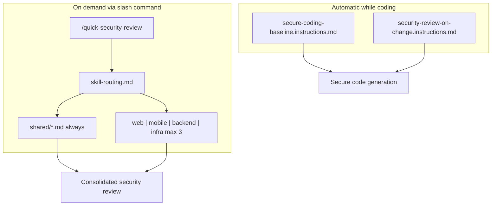

# Architecture

CloudStaff Security AI Skills is a **markdown-only** system for VS Code + GitHub Copilot. No code execution, no setup scripts, no runtime.

---

## Layers

| Layer | Location | When active | Purpose |
|-------|----------|-------------|---------|
| **Instructions** | `.github/instructions/*.instructions.md` | Automatic (`applyTo`) | Prevent insecure patterns while coding |
| **Entry skill** | `.github/skills/quick-security-review/SKILL.md` | `/quick-security-review` | Orchestrate diff review |
| **Router** | `.github/skills/quick-security-review/skill-routing.md` | Loaded by entry skill | Deterministic domain selection |
| **Shared modules** | `.github/skills/shared/*.md` | Always loaded | Universal gates, checks, severity |
| **Domain modules** | `.github/skills/{web,mobile,backend,infra}/*.md` | Up to 3 per review | Domain-specific checks |

---

## Slash Commands vs Modules

**Only folders containing `SKILL.md` become Copilot slash commands.**

| Path | Slash command? |
|------|----------------|
| `skills/quick-security-review/SKILL.md` | Yes → `/quick-security-review` |
| `skills/shared/` | No — support modules |
| `skills/web/`, `mobile/`, `backend/`, `infra/` | No — domain modules |

Domain and shared folders are loaded **by reference** when the entry skill runs. They are not independently invokable.

---

## Deterministic Router

The system behaves as a **security router**, not a free-form agent:

1. Read git diff only — no full repo scan
2. Apply path patterns from `skill-routing.md` — no AI discretion on module selection
3. Always load `shared/` (4 files)
4. Select max 3 domain folders by match count
5. Load all module files within each selected domain
6. Apply shared gates, then domain checks, on changed lines only
7. Output one consolidated report

See [routing-explained.md](routing-explained.md) for the full algorithm.

---

## Copy Model

Developers copy from the skills repo into their **application repository**:

| Skills repo | App repo |
|-------------|----------|
| `instructions/*` | `.github/instructions/*` |
| `skills/**` (entire tree) | `.github/skills/**` |

`docs/` and `templates/` stay in the skills repo — author reference only.

After copying, reload VS Code: `Ctrl+Shift+P` → Developer: Reload Window.

---

## Design Principles

1. **Markdown-only** — instructions and skills are plain markdown; Copilot reads them as context
2. **Separation of concerns** — instructions prevent; skills detect on demand
3. **Modular domains** — web, mobile, backend, infra checks live in separate files
4. **Shared rules once** — exploitability gate, noise rules, severity defined in one place
5. **Deterministic routing** — same diff paths → same modules loaded
6. **Chat-only output** — no report files, no temp files, no code execution

---

## Related Docs

- [skill-overview.md](skill-overview.md) — module catalog
- [routing-explained.md](routing-explained.md) — routing algorithm and examples
- [vscode-setup.md](vscode-setup.md) — setup and verification
- [contributing.md](contributing.md) — authoring guidelines
