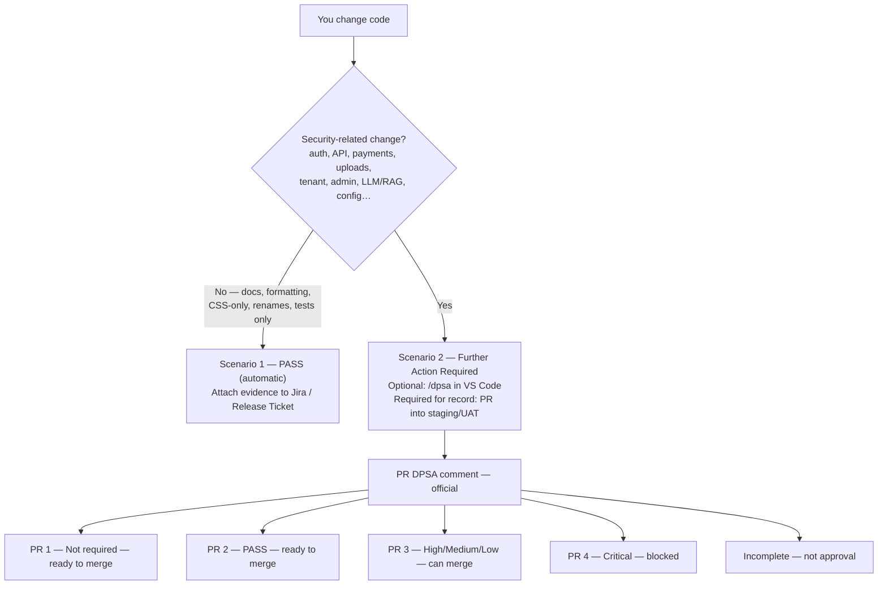

# Development Workflow

How developers use Cloudstaff AI Security across the coding lifecycle.

---

## Two triggers (same report)

| | VS Code `/dpsa` | GitHub Action |
|--|-----------------|---------------|
| **When** | Optional, **before** a PR | Automatic when a same-repo PR targets **staging/UAT** |
| **Job** | Preview — fix early | **Official record** on the PR |
| **Blocks merge?** | No | **Critical** — draft + `dpsa-blocked`. Unblock: fix those lines and push, **or** `dpsa-exception` plus Finding Analyst as a PR comment. Ready for review does not unlock. |
| **If issues** | Usual guide: Finding Analyst; fix or open the PR | **Critical** blocks until fix or `dpsa-exception`. High/Medium/Low: Finding Analyst; merge allowed |
| **Evidence** | Screenshot only if you never open a PR | PR comment + PR URL on Jira — no screenshot |

Developers do **not** need both. `/dpsa` in chat is optional preview. The staging/UAT PR is the official review.

---

## Layers at a glance

| Layer | When | What |
|-------|------|------|
| **Secure coding baseline** | Every file, automatic | Secure coding guardrails while you work |
| **CIA self-check** | Sensitive paths (widened `applyTo`), automatic | Brief security reminder — **CIA = Confidentiality, Integrity, Availability**. Baseline covers Scenario 2 fallback outside those paths. |
| **Security Advisor** | Planning / design / ticket refinement | Threats, abuse cases, security acceptance criteria, Jira notes |
| **`/dpsa` or Security Review** | Optional preview before PR | Same report as CI |
| **DPSA Finding Analyst** | After a DPSA finding | Confirm the File+Line; suggest a small fix — never edits |
| **Dependabot Advisor** | After a Dependabot alert | Guidance and bump implications — never upgrades |
| **PR into staging/UAT** | Automatic GitHub Action | Official comment; **Critical** can fail the check |
| **`/full-assessment-security-review`** | Sprint / release | Wide-scope assessment |
| **`/jira-security-advisory`** | Ticket analysis | Fetch issue via MCP; optional confirmed comment |
| **`/dependabot-assess`** | Dependabot High/Critical (or alert # / range) | Chat assessment — never upgrades |

Instructions are automatic. Skills and agents are on demand.

---

## `/dpsa` vs Security Review agent

Both execute the **same** review workflow (same report template and next steps).

| Prefer… | When |
|---------|------|
| **`/dpsa`** | You want the security report directly |
| **Security Review agent** | You prefer interacting with an AI persona in chat |

Use **Security Advisor** during feature planning, backlog refinement, or design discussions **before** implementation. Use **Security Review** / `/dpsa` **after** code has changed. Use **DPSA Finding Analyst** on one pasted File+Line (suggestions only). Use **Dependabot Advisor** to talk through an alert — never to bump.

---

## Scenario flow

Full matrix: [`skills/shared/dpsa-next-steps.md`](../skills/shared/dpsa-next-steps.md).

1. **As you code** — baseline and CIA self-check (automatic)
2. **Non-security-only?** Instruction Scenario 1 in chat. On the staging/UAT PR: **PR Scenario 1** (Not Required — ready to merge)
3. **Security-related?** Instruction Scenario 2. **Official:** open a same-repo PR into staging/UAT. **Optional:** `/dpsa` in VS Code first — not required.
4. **PR Scenario 2 (PASS)** — ready to merge; this comment fulfills the security review requirement. Link the PR on Jira.
5. **PR Scenario 3** — High / Medium / Low only. Paste into **DPSA Finding Analyst**. Check does not fail. True positive → prefer fix or merge (Security tracks from the comment). False positive → merge; Security marks false positive in monitoring.
6. **PR Scenario 4** — Critical. PR is blocked. Finding Analyst, then fix and push, **or** `dpsa-exception` (developer or Security) **and** paste the Finding Analyst result as a **PR comment**.
7. **Incomplete** → fix scope and push — not approval

**Tip:** `/dpsa` is the AI report on the PR. Sample comments: [dpsa-pr-scenario-samples.md](dpsa-pr-scenario-samples.md).

---

## Evidence on PASS

If a **PR DPSA comment** exists: link the PR on Jira / Release Ticket. Do not screenshot-attach.

Screenshot-attach only when there is no PR.

---

## Related

- [vscode-setup.md](vscode-setup.md) — install and verify
- [architecture.md](architecture.md) — layers and copy model
- [routing-explained.md](routing-explained.md) — how `/dpsa` picks domains
- [owasp-severity.md](owasp-severity.md) — severity scoring
- [dpsa-github-actions.md](dpsa-github-actions.md) — PR comment + Critical gate
