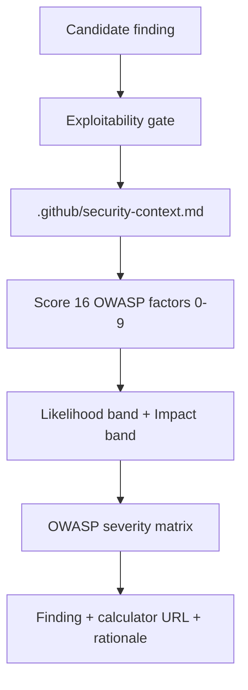

# OWASP Severity Guide

How Cloudstaff AI Security determines finding severity using the [OWASP Risk Rating Calculator](https://owasp-risk-rating.com/).

---

## Why OWASP?

Fixed severity (e.g. "secret = Critical") does not fit Cloudstaff's environment:

- 70+ applications across web, Android, iOS
- Private GitHub repos with **assigned-developer-only** access
- App sizes vary (Low, Medium, High, Critical)
- Same finding type can be Low or Critical depending on context

Your team already uses OWASP vectors in assessments. The skill system aligns with that workflow.

---

## How It Works



1. Finding passes **exploitability gate** ([`exploitability-gate.md`](../skills/shared/exploitability-gate.md)) — inclusion filter; secrets in diff always pass
2. Read `.github/security-context.md` if present (else Cloudstaff defaults)
3. Score OWASP factors based on diff + context
4. Compute likelihood and impact bands
5. Apply severity matrix
6. Output finding with calculator URL and analyst-style rationale

Implementation: [`skills/shared/owasp-risk-rating.md`](../skills/shared/owasp-risk-rating.md)

---

## Per-App Context File

Copy [`templates/security-context.md`](../templates/security-context.md) to `.github/security-context.md` in each app repo.

```yaml
---
app_name: MyApp
app_size: Low              # Low | Medium | High | Critical
platform: web              # web | android | ios | multi
repo_access: assigned_developers_only
estimated_users: 500
data_classification: internal
production_deployed: true
external_users: false
---
```

| Field | Affects |
|-------|---------|
| `app_size` | Business impact (FD, RD, NC, PV) |
| `repo_access` | Opportunity (O), threat agent Size (S) |
| `external_users` | Threat agent Size (S) |
| `data_classification` | Business impact scaling |

Optional — if missing, skill uses Cloudstaff defaults (assigned-dev-only repo, Medium app size).

Report header shows: `**Context:** security-context.md loaded | defaults (no security-context.md)`

---

## Severity Matrix

| | Impact LOW | Impact MEDIUM | Impact HIGH |
|--|------------|---------------|-------------|
| **Likelihood LOW** | Note (skip) | Low | Medium |
| **Likelihood MEDIUM** | Low | Medium | High |
| **Likelihood HIGH** | Medium | High | Critical |

**Never rate Critical from finding type alone** — requires HIGH likelihood + HIGH impact (or equivalent matrix result).

---

## Example — Exposed Secret in Private Repo

**Finding:** Google API key in GitHub repository; unable to verify if production.

**Context:** assigned developers only, app_size Low, internal data.

**Vector:**

```
https://owasp-risk-rating.com/?vector=(SL:3/M:1/O:4/S:2/ED:7/EE:5/A:6/ID:8/LC:0/LI:0/LAV:0/LAC:0/FD:1/RD:1/NC:2/PV:0)
```

**Overall severity:** Low

**Rationale:** Repository access limited to assigned developers; low business impact for small internal app; recommend removing secret regardless of severity.

This matches how security analysts assess issues today — not automatic Critical for every exposed credential.

---

## Finding Output Format

Each finding in `/dpsa` includes:

```markdown
- **[Low] Exposed API key in source**
  - File: `config/settings.ts`
  - Line: 42
  - Security impact: Assigned developers with repo access could extract key
  - Fix: Remove from source; rotate key; use secret manager
  - Confidence: High
  - OWASP Risk Rating: https://owasp-risk-rating.com/?vector=(...)
  - Severity rationale: Private repo, assigned-dev access only, Low app size — limits opportunity and business impact.
```

---

## Cloudstaff Defaults (no context file)

| Assumption | Effect on scoring |
|------------|-------------------|
| Private repo, assigned devs only | Opportunity 0–4, Size 2 |
| Unknown app size | Medium for business impact |
| No external users | Threat agent not anonymous Internet |

Conservative for exposure, not alarmist — secrets still reported, severity reflects context.

---

## Related Docs

- [architecture.md](architecture.md) — system overview
- [vscode-setup.md](vscode-setup.md) — setup including context file
- [skill-overview.md](skill-overview.md) — module catalog
