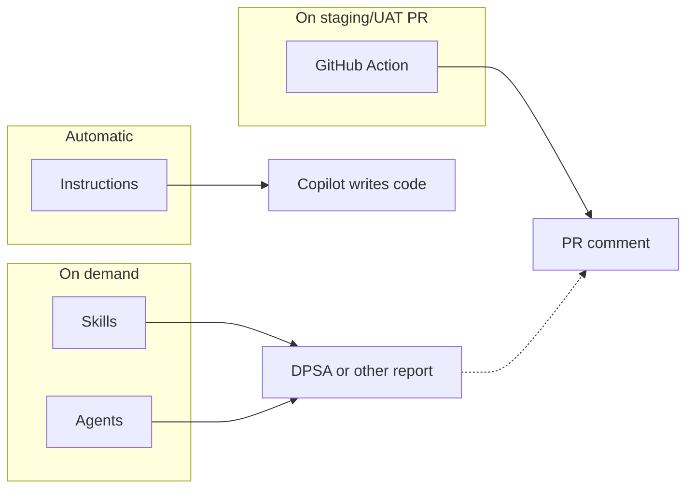
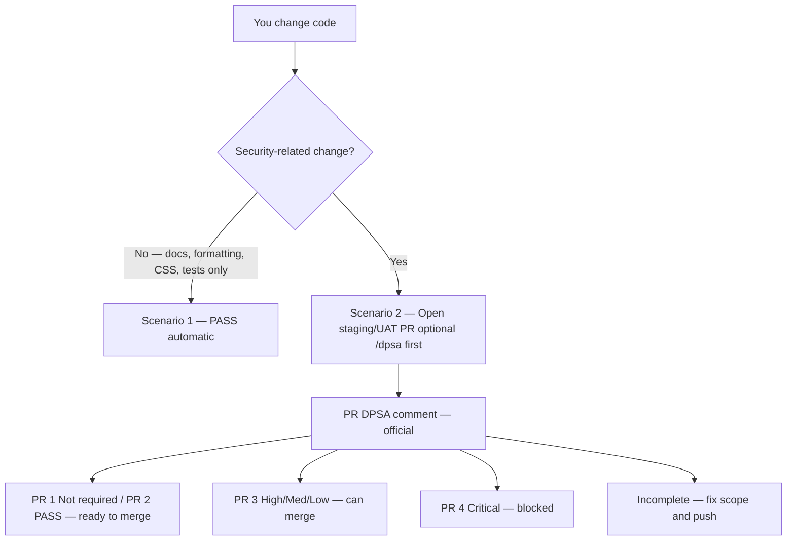
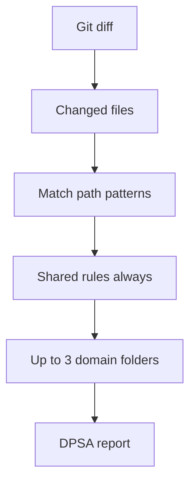

# Cloudstaff AI Security — Product Guide

What this toolkit **is**, what each piece **does**, and how developers use it. Install steps stay in the [README](../README.md).

Gray boxes are **screenshot placeholders**. Drop real PNGs in [`docs/images/`](images/README.md) when you have them. Video URLs are placeholders too.

---

## Watch the presentation

Spoken walkthrough (~10 minutes): [What’s New talk script](presentations/whats-new-talk-script.md).

> **Video placeholder** — paste your recording (SharePoint, Stream, YouTube, or Loom).

- [Watch: overview (what this toolkit does)](https://REPLACE-ME)
- [Watch: developer setup in VS Code](https://REPLACE-ME)
- [Watch: staging/UAT PR and the DPSA comment](https://REPLACE-ME)

Until those links are real, this page and the talk script are the walkthrough.

---

## What this is

Cloudstaff AI Security is a **markdown toolkit** for **VS Code + GitHub Copilot**. Teams copy its folders into an **application** repo’s `.github/`. Copilot then:

- Writes safer code while it is editing (instructions)
- Can run a **Digital Product Security Assessment (DPSA)** on a git diff (skill + optional agent)
- Posts that **same DPSA** on a same-repo PR into **staging/UAT** (GitHub Action)
- Can talk through planning, one finding, or a Dependabot alert (agents + other skills)

It does **not** run your app, install packages, or replace the Security Team. `/dpsa` is the **AI report**. The official record is the PR comment.

This repo has **no** `.github/` of its own. You always copy **into the app**.

---

## What this is not

| Not this | What we actually do |
|----------|---------------------|
| A scanner that blocks every PR | Official DPSA runs on **staging/UAT** PRs. **Critical** can fail the check; High/Medium/Low comment only |
| A required `/dpsa` before you open a PR | VS Code `/dpsa` is **optional preview**. Never blocks |
| An auto-fixer | Finding Analyst **suggests**. Dependabot Advisor **never upgrades** |
| A silent Critical bypass | Unblock Critical with `dpsa-exception` **and** a PR comment that pastes DPSA Finding Analyst |

---

## Who uses it

| Role | Typical use |
|------|-------------|
| Developer | Instructions while Copilot edits; optional `/dpsa`; open staging/UAT PR; paste one finding into Finding Analyst |
| Tech lead | Security Advisor on tickets; full-assessment for a sprint; Dependabot assess |
| Security / reviewer | PR DPSA comment as the official record; monitoring tool for findings |

Developers use **VS Code**, not Cursor.

---

## The four layers

| Layer | Where | When | What it does |
|-------|--------|------|----------------|
| **Instructions** | `.github/instructions/` | Copilot **writes or edits** a file | Guardrails + short CIA reminder. Manual typing does not trigger them |
| **Skills** | `.github/skills/` | You type `/…` in Copilot Chat | Deterministic reports (`/dpsa`, full assessment, Jira, Dependabot) |
| **Agents** | `.github/agents/` | You pick a persona in Copilot Chat | Same jobs as skills, or a narrower talk-through (one finding, Dependabot options) |
| **GitHub Action** | `.github/workflows/` + `dpsa-ci/` | Same-repo PR into staging/UAT | Official DPSA comment. Critical can fail the job |

Optional: `.github/security-context.md` — per-app size, platform, users — so OWASP scores fit **this** app. Skills and the Action both read it when it exists; otherwise Cloudstaff defaults.

---

## What each instruction does

Triggered only when **Copilot** generates or edits a file.

### Secure coding baseline

Applies to Copilot edits in general. Pushes back on insecure patterns. For **non-security-only** work (docs, formatting, CSS-only, tests-only, and similar) it appends **Scenario 1: PASS** with related tickets and a short change summary.

### CIA self-check

**CIA = Confidentiality, Integrity, Availability.** When Copilot edits security-sensitive paths (auth, APIs, payments, uploads, tenant, admin, config, LLM/agents, and related folders), it adds a **brief** reminder. That is **not** a DPSA report. Paths outside that list still get the baseline, which can emit Scenario 2 and point you at `/dpsa` or the staging/UAT PR.

---

## What each skill does

Only folders with `SKILL.md` become slash commands. Domain folders (`web/`, `backend/`, …) are **modules the router loads** — not extra commands.

### `/dpsa` — Digital Product Security Assessment

Optional **preview** in VS Code. Reviews the **current git diff** (changed lines only). The **PR comment** uses shorter official templates (PR Scenario 1 / 2 / 3).

| Result (PR comment) | Meaning |
|--------|---------|
| **AI Security Review Not Required** | No security-related changes — ready to merge |
| **PASS** | Security-related diff, no high-confidence findings — ready to merge |
| **Security Issue/s identified!** (PR 3) | High / Medium / Low only — can merge |
| **Security Issue/s identified!** (PR 4) | **Critical** — PR blocked until fix or `dpsa-exception` |
| **REVIEW INCOMPLETE** | Could not finish — not approval |

VS Code `/dpsa` **never** blocks merge. You do **not** have to run it before opening a PR.

### `/full-assessment-security-review`

Sprint or release scope: date range, branch, or PR(s). Loads **all** matching domains (not capped at 3). Executive summary + recommended actions.

### `/jira-security-advisory`

Optional. Fetch a Jira issue via [Atlassian MCP](jira-copilot-setup.md), write Security Advisor sections, comment on the ticket only after you confirm **yes**.

### `/dependabot-assess`

Compare a GitHub Dependabot alert to **this app** (usage, reachability, blast-radius **advice**). Default: 3 newest open High/Critical. Or `/dependabot-assess 11` / `1-5`. **Never** upgrades, edits lockfiles, or dismisses alerts.

---

## What each agent does

Personas in the Copilot Chat **picker**. Copy all four `agents/*.agent.md` into the app `.github/agents/`.

| Agent | When | Does | Does not |
|-------|------|------|----------|
| **Security Review** | After code exists | Same workflow as `/dpsa` | Edit files |
| **Security Advisor** | Before code (tickets, design) | Threats, abuse cases, security AC, Jira notes | Emit a DPSA report |
| **DPSA Finding Analyst** | After a DPSA finding | Confirm one File+Line; **suggest** a minimal fix | Edit files; re-run full `/dpsa` |
| **Dependabot Advisor** | After an alert | Explain risk and bump **options** | Upgrade or edit lockfiles |

Use Advisor **before** implementation. Use Review / `/dpsa` **after** code changed. Use Finding Analyst on **one pasted finding**. Use Dependabot Advisor to talk through an alert — never to bump.

---

## Two DPSA triggers (same report)

| | VS Code `/dpsa` | GitHub Action |
|--|-----------------|---------------|
| **When** | Optional, before or beside a PR | Automatic on a same-repo PR into **staging/UAT** |
| **Job** | Preview — fix early | **Official record** on the PR |
| **Blocks merge?** | Never | **Critical** — draft + `dpsa-blocked`. Ready for review does not unlock. |
| **Unblock Critical** | n/a | **`dpsa-exception`** (developer or Security) **and** Finding Analyst pasted as a PR comment — or fix those lines and push |
| **High / Medium / Low** | Comment in chat | Comment on the PR — check does not fail. Finding Analyst: true positive → prefer fix or merge (Security Team tracks); false positive → merge |
| **Evidence** | Screenshot only if there is never a PR | PR comment + **PR URL** on Jira — do not duplicate with a screenshot |

Sample PR comments: [dpsa-pr-scenario-samples.md](dpsa-pr-scenario-samples.md).

---

## GitHub Actions and Copilot skills

The Action is **Copilot CLI** in CI, pointed at the **same** `/dpsa` skill that VS Code uses.

1. Checkout the PR head; fetch the base branch
2. Run Copilot with `.github/dpsa-ci/dpsa-ci-prompt.md` — follow `.github/skills/dpsa/SKILL.md` on `git diff origin/<base>...HEAD` only
3. If `.github/security-context.md` exists, use it for OWASP scoring (same as chat)
4. Post or update **one** PR comment
5. Fail the job only when **Critical > 0** and there is no `dpsa-exception` label

Copilot CLI discovers project skills under `.github/skills/`. CI does **not** run `/dependabot-assess` or `/jira-security-advisory`. File reads are allowed; the workflow extra-allows **git** for the diff. It does not merge, approve, or deploy.

Organization repos use the built-in Actions token (`${{ github.token }}`) — no PAT and no secret. User-owned repos need one fine-grained PAT in Actions secret `COPILOT_GITHUB_TOKEN`. Not one PAT per developer. Setup: [README Quick Setup](../README.md#quick-setup) · [DPSA on pull requests](dpsa-github-actions.md).

---

## How `/dpsa` picks what to read

Shared rules always load (exploitability gate, noise, OWASP, next steps). Domain modules (`web`, `mobile`, `backend`, `infra`) load by **path match**, max **three** on `/dpsa` so Copilot stays inside its context window. Full assessment loads **all** matching domains.

Details: [Routing explained](routing-explained.md) · [Architecture](architecture.md).

---

## I want to…

| I want to… | Use |
|------------|-----|
| Write secure code | Instructions (only when Copilot writes or edits) |
| Preview this diff | `/dpsa` or Security Review agent |
| Official DPSA | Same-repo PR into staging/UAT |
| Check one DPSA finding | DPSA Finding Analyst (suggestions only) |
| Plan a ticket | Security Advisor |
| Sprint / release review | `/full-assessment-security-review` |
| Jira ticket | `/jira-security-advisory` |
| Dependabot vs this app | `/dependabot-assess` or Dependabot Advisor (never upgrades) |

---

## Folders you copy

| Toolkit folder | App path | Purpose |
|----------------|----------|---------|
| `instructions/` | `.github/instructions/` | Automatic while Copilot edits |
| `skills/` | `.github/skills/` | Slash commands + domain modules |
| `agents/` | `.github/agents/` | Chat picker personas |
| `workflows/` | `.github/workflows/` | DPSA PR workflow |
| `dpsa-ci/` | `.github/dpsa-ci/` | CI prompt + comment + Critical enforce |
| `templates/security-context.md` | `.github/security-context.md` | Optional per-app OWASP context |

`docs/` stays in **this** repo (guides). Do not nest a second `.github/` inside the app’s `.github/`.

---

## Where to go next

| Need | Doc |
|------|-----|
| Install and verify in VS Code | [vscode-setup.md](vscode-setup.md) |
| Scenario matrix (PASS / issue / incomplete) | [development-workflow.md](development-workflow.md) |
| Token, branches, Critical fail | [dpsa-github-actions.md](dpsa-github-actions.md) |
| Module catalog | [skill-overview.md](skill-overview.md) |
| OWASP scoring | [owasp-severity.md](owasp-severity.md) |
| Jira MCP | [jira-copilot-setup.md](jira-copilot-setup.md) |
| Add screenshots / video | [images/README.md](images/README.md) |

Internal use — Cloudstaff
