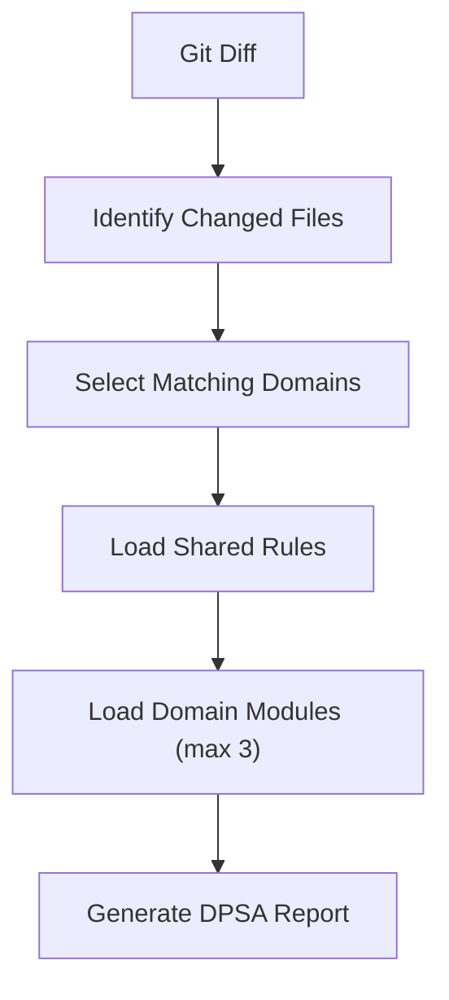

# Routing Explained

How `/dpsa` selects domain modules from a git diff.

The router is defined in `skills/dpsa/skill-routing.md` — the orchestrator must follow it exactly.

---

## Flow



Limiting analysis to the **three most relevant domains** reduces noise, improves response quality, and keeps Copilot within its context window.

Full assessment (`/full-assessment-security-review`) loads **all** matching domains — no cap — because sprint/release reviews need broader coverage.

---

## Algorithm

```
1. Get changed file paths from git diff
2. Count path matches per domain (web, mobile, backend, infra)
3. Rank by count (descending)
4. Select top 3 with count > 0
5. Tie-break: backend > web > infra > mobile
6. If zero matches → shared modules only (no domain folders)
7. Always load the 7 named shared modules required by /dpsa
   (not a glob — exclude jira-integration-safety.md)
8. Load all .md files in each selected domain folder
```

---

## Path Patterns

### web

`components/`, `*.tsx`, `*.jsx`, `*.vue`, `pages/`, `views/`, `frontend/`, `static/`, `hooks/`, `lib/`, `utils/`

### mobile

`android/`, `ios/`, `*.swift`, `*.kt`, `*.kts`, `*.gradle`, `App.tsx`

### backend

`routes/`, `controllers/`, `api/`, `handlers/`, `models/`, `middleware/`, `services/`, `auth/`, `login/`, `llm/`, `agents/`, `prompts/`, `rag/`, `embeddings/`, `vector/`, `*prompt*.*`, `*embedding*.*`, `*agent*.*`, `*.py`, `*.go`, `*.java`, `*.rb`, `*.php`, `*.ts` (`.tsx` remains web-only)

### infra

`*.tf`, `*.tfvars`, `terraform/`, `docker/`, `Dockerfile`, `docker-compose*.yml`, `k8s/`, `helm/`, `.env*`, `cloudformation/`, deploy/k8s/infra/charts `*.yaml`, `package.json`, `requirements.txt`, `go.mod`, `pom.xml`, `Cargo.toml`

Full pattern list: [skill-routing.md](../skills/dpsa/skill-routing.md)

**Note:** Backend pattern `agents/` matches **application code** (e.g. `src/agents/support.ts` — LLM agent implementations). It does **not** refer to Copilot personas in `.github/agents/*.agent.md`. Those are selected from the chat agent picker and are unrelated to skill routing.

---

## Worked Examples

### Example 1 — Backend only

**Diff:**
```
src/routes/users.ts
src/controllers/userController.ts
```

**Match counts:** backend: 2

**Modules loaded:** `shared`, `backend`

**Domain files loaded:**
- `backend/injection-prevention.md`
- `backend/database-security.md`
- `backend/tenant-isolation.md`
- `backend/llm-security.md`

---

### Example 1b — AI agent file

**Diff:**
```
src/agents/support.ts
```

**Match counts:** backend: 1 (`agents/`)

**Modules loaded:** `shared`, `backend`

**Domain files loaded:** all backend modules including `llm-security.md`

---

### Example 2 — Web only

**Diff:**
```
src/pages/LandingPage.tsx
```

**Match counts:** web: 1

**Modules loaded:** `shared`, `web`

**Domain files loaded:**
- `web/auth-review.md`
- `web/api-security.md`
- `web/frontend-security.md`
- `web/business-logic.md`

---

### Example 2b — Plain TypeScript server file

**Diff:**
```
src/server.ts
```

**Match counts:** backend: 1 (`.ts` extension)

**Modules loaded:** `shared`, `backend`

---

### Example 2c — Frontend hook TypeScript

**Diff:**
```
src/hooks/useAuth.ts
```

**Match counts:** web: 1 (`hooks/`), backend: 1 (`.ts`)

**Modules loaded:** `shared`, `backend`, `web` (tie-break: backend before web when equal)

---

### Example 2d — Manifest only

**Diff:**
```
package.json
```

**Match counts:** infra: 1

**Modules loaded:** `shared`, `infra`

**Domain files loaded:**
- `infra/cloud-security.md`
- `infra/iac-security.md`
- `infra/secrets-management.md`
- `infra/dependency-changes.md`

---

### Example 3 — Mixed backend + web

**Diff:**
```
src/routes/api.ts
src/components/UserForm.tsx
```

**Match counts:** backend: 1, web: 1

**Modules loaded:** `shared`, `backend`, `web` (tie-break: backend before web when equal)

---

### Example 4 — Four domains, max 3 cap

**Diff:**
```
terraform/main.tf          → infra: 1
src/routes/auth.go         → backend: 2 (routes + .go)
src/views/login.vue        → web: 1
android/app/MainActivity.kt → mobile: 1
```

**Match counts:** backend: 2, web: 1, infra: 1, mobile: 1

**Selected (top 3):** backend (2), web (1), infra (1) — mobile dropped

**Modules loaded:** `shared`, `backend`, `web`, `infra`

---

### Example 5 — No domain match

**Diff:**
```
README.md
docs/CHANGELOG.md
```

**Match counts:** none

**Modules loaded:** `shared` only

Review applies shared triage from `shared/security-checks.md` (no domain modules). Docs-only diffs typically produce a clean pass via skip rules in that file and `low-noise-rules.md`.

---

## Output Transparency

Every review includes which modules were loaded:

```markdown
**Modules loaded:** shared, backend, web
```

This confirms routing ran correctly. If this line is missing, the orchestrator may not have followed `skill-routing.md`.

---

## What Routing Does NOT Do

- Does not scan untracked files (unless user explicitly names them)
- Does not scan the full repository
- Does not load modules outside the defined structure
- Does not let the AI choose modules by "best guess" — path matching only
- Does not create slash commands for domain folders

---

## Troubleshooting Routing

| Symptom | Likely cause | Fix |
|---------|--------------|-----|
| Wrong domain loaded | Path doesn't match expected pattern | Check pattern table; update `skill-routing.md` if needed |
| `Modules loaded:` missing | Old monolithic skill copied | Re-copy full `skills/` tree including `skill-routing.md` |
| Missing module error | Domain folder not copied to app repo | Copy entire `skills/` tree to `.github/skills/` |
| Docs-only diff shows `shared` only | Zero domain match | Expected — shared triage only; should clean-pass |

See [architecture.md](architecture.md) for system overview.

---

## Full Assessment vs Quick Routing

`/full-assessment-security-review` uses [`full-assessment-security-review/skill-routing.md`](../skills/full-assessment-security-review/skill-routing.md):

| Behavior | Quick | Full Assessment |
|----------|-------|-----------------|
| Domain cap | Max 3 | **All** matches |
| Path patterns | Defined in quick router | **Same** — inherited from quick |
| Scope | Staged / small diff | Resolved via `scope-resolution.md` (dates, PR, branch) |
| Report header | `Modules loaded:` | `Domains loaded:` + `Domains with no changes:` |

Example — same diff as Example 4 (four domains match):

- **Quick:** loads backend, web, infra (mobile dropped — max 3)
- **Full assessment:** loads shared, backend, web, infra, **mobile** (all four)

Scope resolution (PR, date range) is documented in [`scope-resolution.md`](../skills/full-assessment-security-review/scope-resolution.md).
